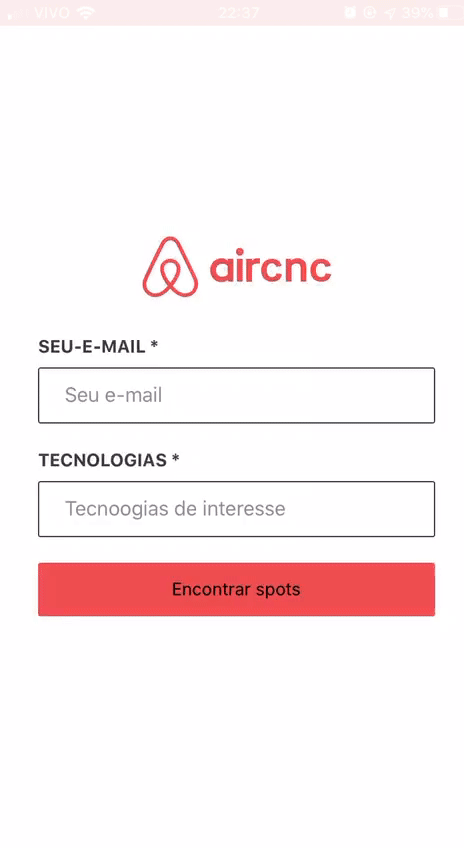

## Aircnc-ReactJs
Aplicação desenvolvida na 9ª Semana Omnistack da <a href="https://rocketseat.com.br" target="_blank"> Rocketseat</a>.
Uma réplica do Aircnc para empresas.
Aplicação React Native a mesma consome dados da API <a href="https://github.com/DanielSilvado/Aircnc-NojeJs" target="_blank">Aircnc-NodeJs</a> 
, lista os Spots premitindo um busca por tecnologias expecificas, clicando o usuário pode fazer uma reserva. 

  

# Tecnologias Utilizadas :

* ReactJs
* axios
* react-navigation
* styled-components
* expo

# Instalação
Para funcionamento da aplicação é necessário utilizar a api <a href="https://github.com/DanielSilvado/Aircnc-NojeJs" target="_blank">Aircnc-NodeJs</a>

**- Se estiver utilizando Yarn**
```
  Todos os comandos abaixo devem ser excutados na raiz do Projeto 
  Para instalar as dependências:
  yarn install   
  
  Para startar a aplicação :
  yarn start 
  
  Executa o aplicativo no modo de desenvolvimento.
  Abra http: // localhost: 3000 para visualizá-lo no navegador. 
   
```

**- Se estiver utilizando npm**
```
  Todos os comandos abaixo devem ser excutados na raiz do Projeto 
  Para instalar as dependências:
  npm install   
  
  Para startar a aplicação :
  npm start 
  
  Executa o aplicativo no modo de desenvolvimento.
  Abra http: // localhost: 3000 para visualizá-lo no navegador. 

```

## Licença

This project is licensed under the MIT License - see the [LICENSE.md](LICENSE.md) file for details
